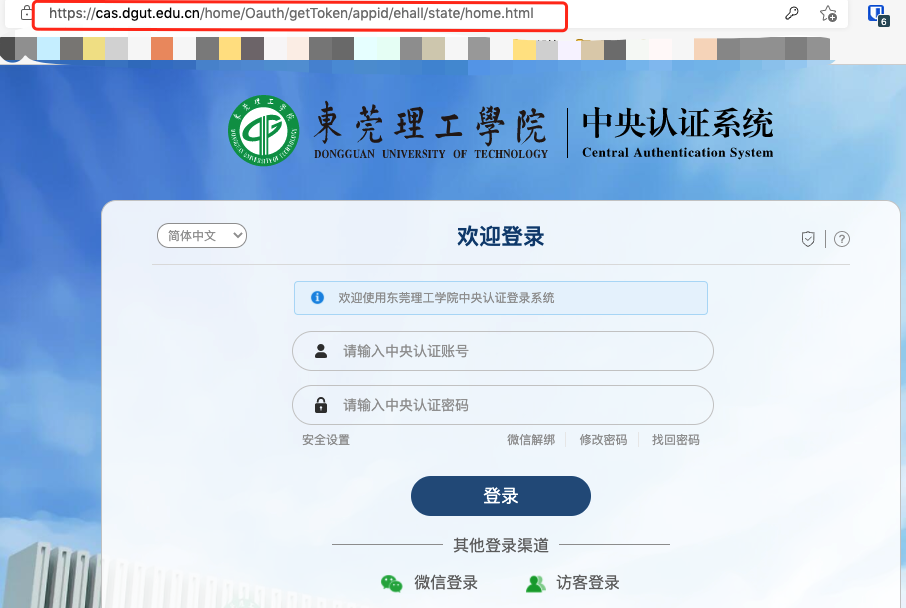

# DGUT-tools
dgut.py: 中央登录系统  
auto_login.py: 防止断网，data数据自己抓  
<br>


1. 获取登录网址
  


2. 登录
```python
cas = CasDgut(login_url=login_url, username=username, password=password)


home_url = cas.login()
print(home_url)
# http://ehall.dgut.edu.cn/home/Login/loginDgut?token=ehall-z-d0c0a8500af273c4b3e5f4de9681465c&state=home


sess = requests.session()

'''
Get Redirect Url
'''
response = sess.get(url=home_url)
re_url = response.url
print(re_url)
# http://ehall.dgut.edu.cn/IndexDetail?token=9pqdcvqq4pc1eu20fra9aal4i3

print(sess.cookies)
# <RequestsCookieJar[<Cookie PHPSESSID=hr04emt0o3eta2h7jrljr7t0p6 for ehall.dgut.edu.cn/>]>
```

3. 使用`sess`，或者保存sess.cookies后导入到其他请求的cookies中，之后的所有请求都可以凭借cookies完成

4. 疫情打卡需要使用access_token,可以自己抓
